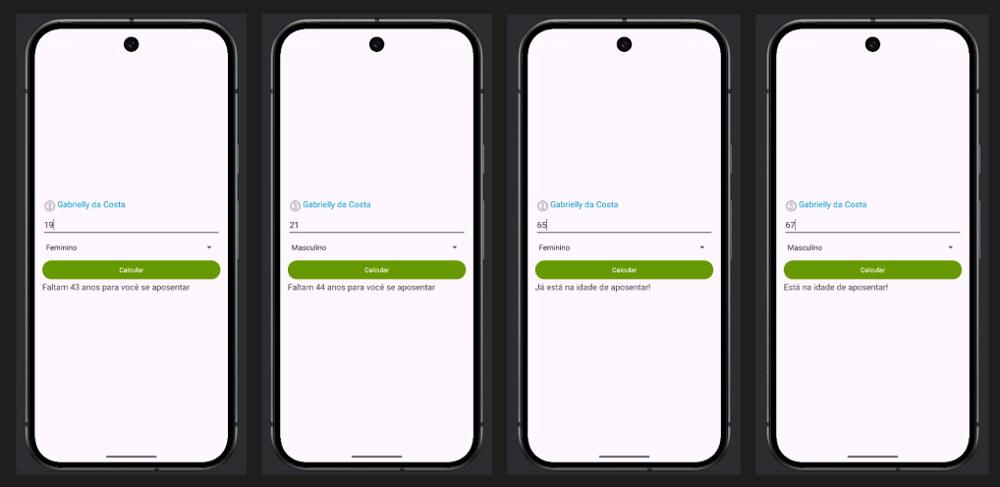

# 🧮 Calculadora de Aposentadoria
Este aplicativo Android foi desenvolvido como parte de uma aula prática utilizando Kotlin e XML no Android Studio. 
Ele permite ao usuário inserir sua idade e selecionar seu gênero para calcular quantos anos faltam para a aposentadoria com base nas regras atuais (2025).

---
 

## 📸 Interface

 

## 🧩 Funcionalidades
- Exibe o nome do desenvolvedor no topo da tela.

- Campo para entrada da idade (com limite de 3 dígitos).

- Spinner para seleção de gênero (Masculino ou Feminino).

- Botão para calcular o tempo restante até a aposentadoria.

- Exibição do resultado com mensagem personalizada.

 

> ## 📡 Tecnologias Utilizadas
> Linguagem: Kotlin  
>
> Layout: XML com LinearLayout  
>
> Binding: View Binding (ActivityMainBinding)  
>
> Componentes Android: TextView, EditText, Spinner, Button  

 

## 📐 Lógica de Cálculo
A lógica considera as idades mínimas para aposentadoria:

- Masculino: 65 anos

- Feminino: 62 anos

Se a idade inserida for menor que o limite, o app mostra quantos anos faltam. Caso contrário, informa que já está na idade de se aposentar.

 

## 🚀 Como Executar

- Clone o repositório ou copie os arquivos para seu projeto Android Studio.

- Certifique-se de que o View Binding está habilitado no build.gradle.

- Execute o projeto em um emulador ou dispositivo físico.

 

## 👩‍💻 Desenvolvedora

Gabrielly da Costa 

Projeto criado para fins educacionais.

